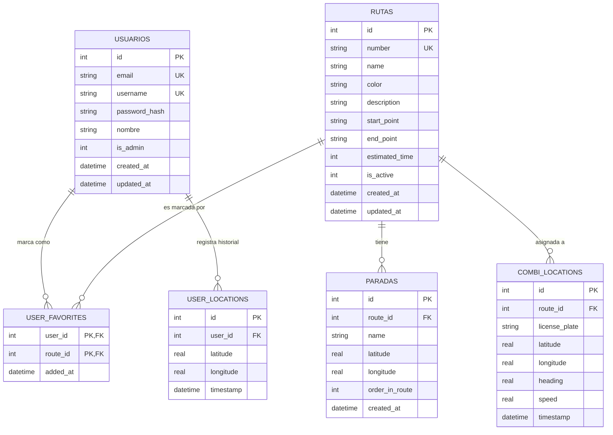

# Combis App — Schema de Base de Datos y Guía de Datos

Este documento define la fuente de verdad para el manejo de datos en la aplicación, incluyendo el esquema SQLite local y la estructura de modelos en Dart. Se basa en la arquitectura definida en [ARCHITECTURE.md](docs/es/ARCHITECTURE.md).

## 1. Diagrama de Entidad-Relación (ER)



---

## 2. Definición del Esquema SQL (SQLite)

Este es el esquema que implementa el `DatabaseHelper` para asegurar consistencia entre la base de datos y los modelos de Dart.

```sql
-- TABLA: usuarios
CREATE TABLE usuarios (
  id INTEGER PRIMARY KEY AUTOINCREMENT,
  email TEXT UNIQUE NOT NULL,
  username TEXT UNIQUE NOT NULL,
  password_hash TEXT NOT NULL,
  nombre TEXT NOT NULL,
  is_admin INTEGER NOT NULL DEFAULT 0,
  created_at TEXT NOT NULL,
  updated_at TEXT NOT NULL
);

-- TABLA: rutas
CREATE TABLE rutas (
  id INTEGER PRIMARY KEY AUTOINCREMENT,
  number TEXT NOT NULL UNIQUE,  -- Ej: "A", "3", "C2"
  name TEXT NOT NULL,            -- Ej: "Centro - Volcanes"
  color TEXT NOT NULL,           -- Hex: "#FF6D00"
  description TEXT,
  start_point TEXT NOT NULL,
  end_point TEXT NOT NULL,
  estimated_time INTEGER NOT NULL, -- en minutos
  is_active INTEGER NOT NULL DEFAULT 1,
  created_at TEXT NOT NULL,
  updated_at TEXT NOT NULL
);

-- TABLA: paradas (stops)
CREATE TABLE stops (
  id INTEGER PRIMARY KEY AUTOINCREMENT,
  route_id INTEGER NOT NULL,
  name TEXT NOT NULL,
  latitude REAL NOT NULL,
  longitude REAL NOT NULL,
  order_in_route INTEGER NOT NULL,
  created_at TEXT NOT NULL,
  FOREIGN KEY (route_id) REFERENCES rutas (id) ON DELETE CASCADE
);

-- TABLA: user_favorites
CREATE TABLE user_favorites (
  user_id INTEGER NOT NULL,
  route_id INTEGER NOT NULL,
  added_at TEXT NOT NULL,
  PRIMARY KEY (user_id, route_id),
  FOREIGN KEY (user_id) REFERENCES usuarios (id) ON DELETE CASCADE,
  FOREIGN KEY (route_id) REFERENCES rutas (id) ON DELETE CASCADE
);

-- TABLA: user_locations (Analytics/Historial)
CREATE TABLE user_locations (
  id INTEGER PRIMARY KEY AUTOINCREMENT,
  user_id INTEGER NOT NULL,
  latitude REAL NOT NULL,
  longitude REAL NOT NULL,
  timestamp TEXT NOT NULL,
  FOREIGN KEY (user_id) REFERENCES usuarios (id) ON DELETE CASCADE
);

-- TABLA: combi_locations (Tiempo Real - Fase 5)
CREATE TABLE combi_locations (
  id INTEGER PRIMARY KEY AUTOINCREMENT,
  route_id INTEGER NOT NULL,
  license_plate TEXT NOT NULL,
  latitude REAL NOT NULL,
  longitude REAL NOT NULL,
  heading REAL,
  speed REAL,
  timestamp TEXT NOT NULL,
  FOREIGN KEY (route_id) REFERENCES rutas (id) ON DELETE CASCADE
);
```

---

## 3. Mapeo a Modelos Dart

Para asegurar la integridad, los modelos en `lib/data and db/models/` deben seguir estas estructuras:

### 3.1 `AppRoute` (`route.dart`)
Mapeado directamente a la tabla `rutas`. Las paradas se cargan como una lista relacionada.

```dart
class AppRoute {
  final int id;
  final String number;
  final String name;
  final String color;
  final String? description;
  final String startPoint;
  final String endPoint;
  final int estimatedTime;
  final bool isActive;
  final DateTime createdAt;
  final DateTime updatedAt;
  final List<StopPoint> stops;
  // ... constructor, fromMap, toMap
}
```

### 3.2 `StopPoint` (`stop_point.dart`)
Mapeado a la tabla `stops`. Incluye helper para `LatLng`.

```dart
class StopPoint {
  final int id;
  final int routeId;
  final String name;
  final double latitude;
  final double longitude;
  final int orderInRoute;
  final DateTime createdAt;
  // ... helper toLatLng()
}
```

---

## 4. Estado Inicial y Siembra (Seeding)

En la **Fase 3b**, el archivo `lib/utils/seeder.dart` será el encargado de poblar la base de datos si esta se encuentra vacía.

### Datos de Ejemplo (Ruta Centro):
- **Número:** "A"
- **Nombre:** "Centro -> Volcanes"
- **Color:** `#FF6D00` (Pumpkin Spice)
- **Paradas:** Zócalo, Av. Hidalgo, Volcanes.

---

## 5. Consultas Frecuentes

### Obtener rutas con conteo de paradas:
```sql
SELECT r.*, (SELECT COUNT(*) FROM stops WHERE route_id = r.id) as stop_count
FROM rutas r
WHERE is_active = 1;
```

### Obtener favoritos de un usuario con detalles de ruta:
```sql
SELECT r.* 
FROM rutas r
JOIN user_favorites uf ON r.id = uf.route_id
WHERE uf.user_id = ?;
```
